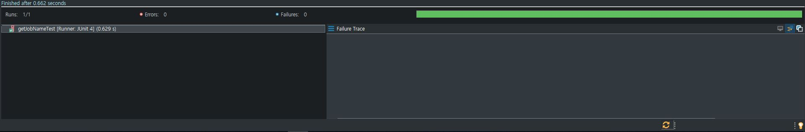

[그림1] 스프링 삼각형

**스프링 삼각형 첫번째 : POJO와 DI**  
스프링 삼각형 두번째 : AOP와 PSA(Portable Service Abstractions)

### POST KEYWORD

{: .box-note}
POJO, 객체지향적인 오브젝트, DI, OCP원칙, 와이어링(wiring), IOC, Bean, ApplicationContext  

삼각형 각변에 위치한 Dependency Injection, AOP, Portable Service Abstractions과 삼각형 내부에 위치한 Plain Object가 있습니다.

Plain Object는 POJO(Plain Old Java Object)를 의미합니다.

## POJO

POJO란 용어는 '리팩토링'의 저자로 유명한 [마틴파울러](https://zetawiki.com/wiki/%EB%A7%88%ED%8B%B4_%ED%8C%8C%EC%9A%B8%EB%9F%AC)가 '간단한 자바오브젝트'라는 말을 있어 보이게 하기 위해 만든 용어라고 합니다.  

[소스1]POJO의 예
~~~
public class Hello {
    public String sayHello{
        return "Hello";
    }
}
~~~

예를 보고 알 수 있는 사실은 POJO란 용어 그대로 간단한 자바오브젝트라는 것입니다.  

'스프링은 **많은 기능을 가진 자바 프로그램 개발을 쉽게 해주는 도구**라고 했는데 저렇게 간단한걸 가지고 무엇을 한단 말이지?' 라는 의문이 들 것입니다.  

스프링삼각형에서 각 변을 둘러싸고 있는 Dependency Injection, AOP, Portable Service Abstractions라는 3가지 가능기술이 POJO를 이용하여 많은 기능을 가진 애플리케이션을 만들게 됩니다.

그렇다면 간단한 오브젝트이면 모두 POJO일까?

POJO는 **객체지향적인 자바오브젝트**여야 합니다. 객체지향적인 자바오브젝트에 대해서는 추후 별도로 다루도록 하겠습니다.

## Dependency Injection

Dependency Injection(이하 DI)는 **의존성 주입** 으로 해석 됩니다.

DI는 POJO가 여러 클래스들을 사용하며 기능을 하도록 돕습니다.

그런데 POJO는 DI의 도움을 꼭 받아야 할까?

### DI의 도움이 없는 POJO
[소스2]
~~~
// Person Class
public class Person {

    // Person의 직업
    DeveloperJob job = new DeveloperJob();

    // 직업의 이름
    public String getJobName(){
        return job.getJobName();
    }

}

// DeveloperJob Class
public class DeveloperJob {
    
    // 직업의 이름을 반환
    public String getJobName(){
        return "developer";
    }
}
~~~

2개의 클래스 Person, DeveloperJob 이 있습니다. 

Person 클래스는 DeveloperJob 클래스를 사용하여 직업을 갖고 직업의 이름을 반환할 수 있습니다.

DeveloperJob(의존성)을 전달(주입) 받지 않고 스스로 DeveloperJob을 사용하고 있습니다.

사실 이 클래스들은 POJO라고 할 수 없습니다.

POJO가 아닌 이유

1. Person 클래스는 DeveloperJob 클래스와 강하게 결합되어 있다.
2. DeveloperJob 클래스는 추상화 되어있지 않다.

즉 각 클래스가 객체지향적인 자바오브젝트가 아니기 때문입니다.

DI를 활용하기 위해서는 객체지향적인 자바오브젝트를 만드는 것이 우선입니다.

### 객체지향적인 자바오브젝트 설계
[소스3]
~~~
// 직업을 추상화하여 Job 인터페이스 생성
public interface Job {
	String getJobName();
}

// developer Job
public class Developer implements Job{
	@Override
	public String getJobName() {
		return "developer";
	}
}

// designer Job
public class Designer implements Job{
	@Override
	public String getJobName() {
		return "designer";
	}
}

// Person 클래스
public class Person {
	private Job job;
	
	public Person(Job job) {
		this.job = job;
	}
	
	public String getJobName() {
		return job.getJobName();
	}
}
~~~

소스2와는 달리 소스3에서는

1. Person 클래스는 각 Job들과 강하게 결합되어 있지 않다. 추상화된 Job 인터페이스와 연결되어 있음.
2. 각 Job들은 추상화된 Job을 구현한다.

이는 **[OCP원칙(Open Closed Principal)](https://ko.wikipedia.org/wiki/%EA%B0%9C%EB%B0%A9-%ED%8F%90%EC%87%84_%EC%9B%90%EC%B9%99)**과 연결됩니다.

1. 확장에 대해서 열려 있다.
 * 새로운 직업을 만들기 위해서 Job 인터페이스 구현체를 만들어 **확장**한다.
2. 수정에 대해서 닫혀 있다.
 * Person의 직업이 변경 되었다면 (developer -> designer) Person에게 designer를 주입하면 된다. 즉 Person 클래스의 **수정**이 필요 없다.

POJO가 만들어졌으니 DI를 활용해 봐야 할 차례입니다.

DI는 POJO들간의 관계를 맺어주는 것으로 **와이어링(wiring)**이라고 부르며 대표적인 방법으로 3가지가 있습니다.

1. 자바에서 명시적 설정
2. XML에서 명시적 설정
3. 자동으로 와이어링  

자바에서 명시적 설정으로 와이어링 해보도록 하겠습니다.

### 자바 설정을 통한 와이어링
[소스4]
~~~
// Person 설정클래스
// Configuration 어노테이션은 해당 클래스가 Bean 설정 클래스임을 명시함
import org.springframework.context.annotation.Bean;
import org.springframework.context.annotation.Configuration;

@Configuration
public class PersonConfig {
	
    // Person 클래스에 Developer 주입
	@Bean
	public Person person() {
		return new Person(job());
	}
	
	@Bean
	public Job job() {
		return new Developer();
	}
	
}

// Person Test
// JUnit Test를 이용하여 DI 결과 확인
import static org.junit.Assert.assertEquals;
import org.junit.Test;
import org.springframework.context.annotation.AnnotationConfigApplicationContext;

public class PersonTest {
	@Test
	public void getJobNameTest() {
		
        // context를 가져온다.
		AnnotationConfigApplicationContext context = new AnnotationConfigApplicationContext(PersonConfig.class);
		
        // Person bean을 가져온다.
		Person person = context.getBean(Person.class);

        // 검증한다.
		assertEquals("developer",person.getJobName());
	}
}
~~~

예상대로 DI된 결과를 확인할 수 있습니다.  

#### Bean이란?
> 스프링이 제어권을 가지고 직접 만들고 관계를 부여하는 오브젝트  

스프링이 DI에 활용하는 대상을 Bean이라 부르며, 스프링에 의해 관계가 부여된다는 것은 **IOC(Inversion Of Control)**(제어의 역전)의 개념입니다. 즉 자바 오브젝트들이 자바 오브젝트들간의 관계를 직접 정하지 않고 스프링에 의해 정해짐을 의미합니다.

#### ApplicationContext란?
> Bean을 담는 그릇(Container) 여러 구현체중 하나. 제공하는 기능이 많아 선호되는 Container.

