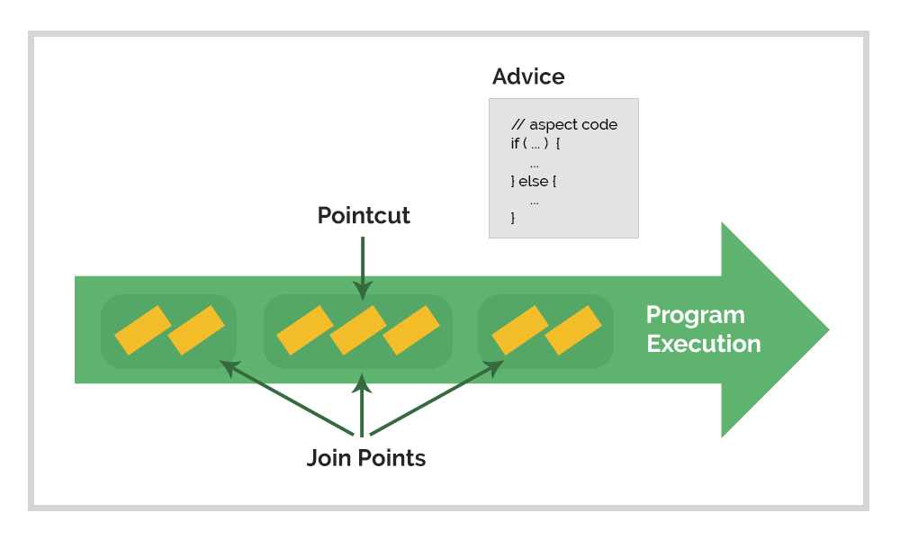

[그림1] 스프링 삼각형

스프링 삼각형 첫번째 : POJO와 DI  
**스프링 삼각형 두번째 : AOP와 PSA(Portable Service Abstractions)**

### POST KEYWORD

{: .box-note}
AOP, 횡단관심사, Advice, JoinPoints, Pointcut, 프록시 객체, PSA, 단일 책임의 원칙

## AOP(Aspect Oriented Programing)

**관점지향프로그래밍**으로 해석될 수 있습니다.  

DI는 자바오브젝트들간의 관계를 스프링이 제어하여 맺게 하는 것이고  
AOP는 자바오브젝트들이 공통적으로 사용하는 기능들( 로깅, 트랜잭션, 보안 등등 )을 분리하는 것입니다.  
**횡단 관심사(cross-cutting concenrs)**(공통적으로 사용 하는 기능을 지칭)를 모듈화 하여 목표를 달성합니다.  

[그림2] AOP 개념

위의 그림에서 새로운 용어가 등장합니다.

Program Executon: 프로그램 실행 흐름  
Advice: '무엇'을 '언제' 할지 정의 하는 것  
Join Points: Advice를 적용할 수 있는 곳들  
Pointcut: '어디서' 할지를 정의 하는 것. Join Points를 선택  

Advice의 '언제'는 Pointcut의 대상이 되는 것이 호출되기 전/후, 예외 발생 후 등을 의미합니다.

이에 추가적으로 알아두어야 할 용어가 있습니다.

Aspect: Advice + Pointcut. '무엇'을 '언제', '어디서' 할지를 정의
Weaving: Aspect를 적용하여 새로운 프록시 객체를 생성하는 절차
* 프록시 객체
> 클라이언트가 사용하려하고 하는 대상이 실제 대상이 아니라 실제 대상인 것처럼 위장하여 클라이언트의 요청을 받아주는 대리자 객체  

즉 Aspect는 대상 객체에 곧바로 적용되는 것이 아니라 프록시 객체를 통해 적용이 됩니다.

Weaving은 대상 객체의 생애 중 3가지 시점에서 수행 됩니다.  
1. 컴파일시
2. JVM 클래스 로드시
3. 런타임시

앞서 작성하였던 Person 클래스의 getJobName()메소드에 Aspect를 적용해보도록 하겠습니다.

### Aspect 적용
[소스1]
~~~
// Aspect 클래스 생성
import org.aspectj.lang.annotation.AfterReturning;
import org.aspectj.lang.annotation.AfterThrowing;
import org.aspectj.lang.annotation.Aspect;
import org.aspectj.lang.annotation.Before;
import org.aspectj.lang.annotation.Pointcut;

@Aspect
public class MethodAspect {
	
	// 포인트컷 정의
	// Job 인터페이스의 getJobName 메소드가 호출될때
	@Pointcut("execution(* com.example.springTest.Job.getJobName(..))")
	public void callMethod() {}

	// getJobName 메소드 호출 전 수행될 애스펙트
	@Before("callMethod()")
	public void beforeCallMethod() {
		System.out.println("getJobName() 호출 전");
	}
	
	// getJobName 메소드 호출 후 수행될 애스펙트
	@AfterReturning("callMethod()")
	public void afterCallMethod() {
		System.out.println("getJobName() 호출 후");
	}

	// getJobName 메소드 호출 시 예외 발생한 경우 수행될 애스펙트
	@AfterThrowing("callMethod()")
	public void afterCallMethodThrowing() {
		System.out.println("getJobName() 호출 시 예외 발생");
	}
}

// 기존 DI 설정 클래스에 aspect 설정 추가
import org.springframework.context.annotation.Bean;
import org.springframework.context.annotation.Configuration;
import org.springframework.context.annotation.EnableAspectJAutoProxy;

@Configuration
@EnableAspectJAutoProxy		// 오토프록싱 설정 ( 포인트컷에 일치하는 다른 빈의 프록시를 생성 )
public class PersonConfig {
	
	@Bean
	public Person person() {
		return new Person(job());
	}
	
	@Bean
	public Job job() {
		return new Developer();
	}
	
	// MethodAspect 클래스를 빈으로 설정
	@Bean
	public MethodAspect methodAspect() {
		return new MethodAspect();
	}
	
}

// Person 클래스
public class Person {
	private Job job;
	
	public Person(Job job) {
		this.job = job;
	}
	
	public String getJobName() {
		return job.getJobName();
	}
}

// Developer 클래스
public class Developer implements Job{
	@Override
	public String getJobName() {
		System.out.println("developer");		// 직관적 확인을 위해 추가
		return "developer";
	}
}

// Person Test 클래스
import static org.junit.Assert.assertEquals;

import org.junit.Test;
import org.springframework.context.annotation.AnnotationConfigApplicationContext;

public class PersonTest {
	@Test
	public void getJobNameTest() {
		
		AnnotationConfigApplicationContext context = new AnnotationConfigApplicationContext(PersonConfig.class);
		
		Person person = context.getBean(Person.class);

		person.getJobName();
	}
}
~~~

다음과 같이 getJobName() 메소드 호출 전후로 애스펙트가 적용된 것을 확인할 수 있습니다.

**테스트 결과**  

## PSA(Portable Service Abstractions)

직역하자면 **휴대용 서비스 추상화**가 되겠지만 Portable은 특정환경 및 기술에 종속되지 않음을 강조하는 의미로 해석됩니다.

PSA는 여러 종류의 기술(트랜잭션 서비스, 메일 서비스, JPA(Java Persistence API) 등등)을 추상화하여 특정 사용 기술에 종속되지 않고 POJO에 특정 기술에 대해 직접적인 노출이 없도록 합니다.  
계층과 책임을 분리하여 각 계층간 결합도를 낮춥니다. 계층에는 애플리케이션 계층(비즈니스 로직), 서비스 계층(중간계층), 기술 서비스 계층(로우레벨)이 있습니다. 계층간 결합도가 낮다는 것은 사용중인 기술 서비스 계층의 변화가 있을 경우 애플리케이션 계층의 변경이 전혀 없거나 거의 없음을 의미합니다. 이를 통해 각 계층이 독립적으로 확장될 수 있음을 알 수 있습니다.  

이러한 분리는 객체지향 설계의 원칙 중 **단일 책임 원칙(Single Responsibility Principle)**을 따릅니다. 하나의 모듈은 하나의 책임을 가져야 한다는 원칙으로, 각 계층은 각자가 가진 책임외에는 어떠한 책임도 가지지 않습니다. 그렇기 때문에 변화에 대응하기 쉬운 장점을 가질 수 있습니다.

## 스프링 삼각형  
삼각형 세 변을 이루고 있는 DI, AOP, PSA 와 삼각형 내부의 POJO는 유기적으로 연결되어 있습니다. 이들 중 핵심은 DI라고 할 수 있습니다. POJO라는 간단한 자바 오브젝트를 재료로 DI를 통해 AOP,PSA 기술들을 적용합니다. 이는 각자 담당하고 있는 기능들을 적당하게 계층화하여 책임을 분산하고 결합도를 낮춰 변화에 대응하기 쉽게 하기 위한 개발 방법입니다. 
