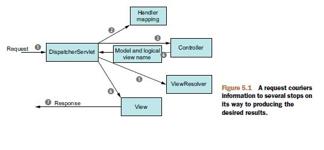
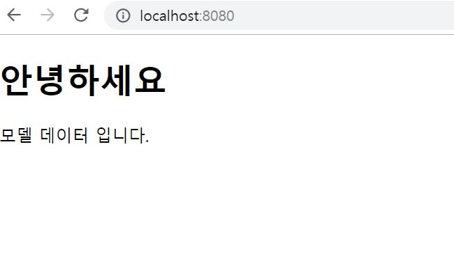

1. 사용자가 Browser를 통해 주소를 입력한다.
2. **Controller가 View를 Browser에 나타나게 한다.**
3. 사용자가 View에서 액션(클릭, 입력창 엔터 등등)을 하면 그 요청이 Controller에 전달되고 Model로 다시 전달된다.
4. Model에서 요청을 처리하고 View에게 변화(요청에 대한 처리 결과)를 알린다.
5. View는 변화를 반영하고 Controller를 통해 Browser에 나타난다.

지난번 포스팅에서 사용자의 로컬컴퓨터에서 원하는 자원을 어떻게 가져올 수 있는지 알아 보았습니다.  

문자로 이루어진 주소를 DNS서버에서 IP로 변환하여 자원을 요청하고 응답을 받게 되는데,  

이번 포스팅에서는 자원에 대한 요청이 어떻게 처리 되어 응답을 해주게 되는지에 대해 이야기 해보겠습니다.  

  
[그림1. 요청에서 응답까지 ( Craig Walls - Spring in Action 4th Edition - 2014. 132p)]  

자원에 대한 요청이 스프링 웹 애플리케이션에 처음 도달하는 곳은 **DispatcherServlet** 입니다.  

요청을 받아 **컨트롤러(Controller)**에 전달이 되어야 하는데 어떤 컨트롤러에 전달되어야 하는지를 **Handler Mapping**이 알고 있습니다.  

Handler Mapping의 도움을 받아 어떤 컨트롤러로 요청이 전달되어야 하는지를 알아내고 해당 컨트롤러에 요청을 보냅니다.  

컨트롤러는 요청을 직접처리하기도 하지만 보통은 처리의 역할을 하는(**비즈니스 로직을 의미**) 서비스 객체에 위임합니다 ( 서비스 객체 너가 대신 처리 하렴~ ).  

그러면 컨트롤러는 단순히 요청을 서비스 객체에 연결해주는 역할만 하는듯 보이지만 꼭 그렇지는 않습니다.

어쨌든 서비스 객체가 처리한 결과를 **모델(model)**이라고 부르는데 **논리뷰 이름(logical view name)**과 함께 DispatcherServlet에게 보냅니다.  

'논리뷰 이름'이란 실제의 **뷰(view)**(화면을 구성하는 대상(html, jsp 등등))를 찾기위한 이름입니다.

실제의 뷰 home.html 의 논리뷰 이름은 home이 될 수 있는 것입니다. 이것은 정하기 나름입니다.  

DispatcherServlet이 사용자의 요청을 어떤 컨트롤러에 보내야할지를 알아내기 위해 Handler Mapping의 도움을 받았듯이 

DispatcherServlet은 **뷰리졸버(ViewResolver)**의 도움을 받습니다.  

논리뷰 이름을 보내 실제의 뷰가 무엇인지를 물어보는 것이죠.  

실제의 뷰가 무엇인지 알아냈으니 뷰에 모델데이터를 넣는 작업을 하고 응답객체에 뷰를 실어 사용자에게 보여지게 되는 것입니다.  

지금까지 Controller가 View를 Browser에 나타나게 한다는 것에 대한 조금은 세부적인 이야기였습니다.

이제 실제로 구현 해보도록 하겠습니다.  

구현 해야할 대상은 총 4개 입니다.

DispatcherServlet, WebConfig(ViewResolver를 설정), Controller, View

설정과 관련된 DispatcherServlet, WebConfig는 여러가지로 작성이 가능하지만( XML파일, Property파일, Java 등등 ) Java로 설정해 보겠습니다.  

( Java를 사용하여 작성하게 되면 컴파일러의 도움(오타 발견)을 받을 수 있고 IDE의 자동완성 기능을 사용할 수 있다는 장점이 있으나 설정정보 변경시 재컴파일 해야한다는 단점도 있습니다. )

~~~
// Spring Boot(2.1.4) 사용
// 기본적인 설정이 Boot에서는 자동으로 되어있지만 명시적으로 설정해보겠습니다.
// 이클립스에서 Spring Starter Project를 통해 프로젝트를 생성하는 경우 @SpringBootApplication을 달고 있는 main 함수를 가진 클래스가 있는데 
// 이 클래스와 동일 또는 하위 위치에 설정 클래스가 있어야 제대로 동작합니다.

// DispatcherServlet 설정
// SpringWebAppInitializer 클래스

// web.xml을 자바코드로 대신하기 위해 Springboot에서는 ServletContextInitializer을 구현합니다.(서블릿 3.0 이상 환경에서만 동작합니다.)
   Springboot가 아닌 경우에는 WebApplicationInitializer을 구현합니다.

package com.example.springTest.config;

import javax.servlet.ServletContext;
import javax.servlet.ServletException;
import javax.servlet.ServletRegistration;

import org.springframework.boot.web.servlet.ServletContextInitializer;
import org.springframework.web.context.support.AnnotationConfigWebApplicationContext;
import org.springframework.web.servlet.DispatcherServlet;

public class SpringWebAppInitializer implements ServletContextInitializer{

	@Override
	public void onStartup(ServletContext container) throws ServletException {
		
		AnnotationConfigWebApplicationContext context = new AnnotationConfigWebApplicationContext();
		
		context.register(WebConfig.class);		// 설정 클래스를 명시함
		context.setServletContext(container);	// ServletContext 세터
		
		// dispatcherServlet 객체 생성
		ServletRegistration.Dynamic dispatcher = container.addServlet("dispatcher", new DispatcherServlet(context));
		
		dispatcher.setLoadOnStartup(1);			// 서블릿 로딩의 우선순위. 숫자가 적을 수록 우선순위 높음
		dispatcher.addMapping("/");				// 애플리케이션으로 들어오는 모든 요청을 처리
		
	}
}

// ViewResolver 설정
// WebConfig 클래스

// 타임리프를 사용할것이기 때문에 ThymeleafViewResolver, TemplateEngine, TemplateResolver 설정이 필요합니다.

package com.example.springTest.config;

import org.springframework.context.annotation.Bean;
import org.springframework.context.annotation.ComponentScan;
import org.springframework.context.annotation.Configuration;
import org.springframework.core.Ordered;
import org.springframework.web.servlet.ViewResolver;
import org.springframework.web.servlet.config.annotation.ViewControllerRegistry;
import org.springframework.web.servlet.config.annotation.WebMvcConfigurer;
import org.thymeleaf.spring5.SpringTemplateEngine;
import org.thymeleaf.spring5.view.ThymeleafViewResolver;
import org.thymeleaf.templateresolver.ClassLoaderTemplateResolver;

@Configuration
@ComponentScan("com.example.springTest")
public class WebConfig implements WebMvcConfigurer {
	
	
	// ViewResolver 빈
    @Bean
    public ViewResolver viewResolver() {

        ThymeleafViewResolver viewResolver = new ThymeleafViewResolver();

        viewResolver.setTemplateEngine(templateEngine());
        viewResolver.setCharacterEncoding("UTF-8");

        return viewResolver;
    }

    // templateEngine 빈
    @Bean
    public SpringTemplateEngine templateEngine() {

        SpringTemplateEngine templateEngine = new SpringTemplateEngine();
        templateEngine.setTemplateResolver(templateResolver());

        return templateEngine;
    }

    // templateResolver 빈
    @Bean
    public ClassLoaderTemplateResolver templateResolver() {

        ClassLoaderTemplateResolver templateResolver = new ClassLoaderTemplateResolver();

        templateResolver.setPrefix("templates/");							// 프리픽스 경로 설정. resources가 루트
        templateResolver.setSuffix(".html");								// 서픽스 설정. html 확장자
        templateResolver.setCacheable(false);								// 캐시 사용여부. 
        templateResolver.setTemplateMode("HTML");							
        templateResolver.setCharacterEncoding("UTF-8");

        return templateResolver;
    }

    @Override
    public void addViewControllers(ViewControllerRegistry registry) {
        registry.addViewController("/").setViewName("forward:/home");		// /home 요청으로 포워딩
        registry.setOrder(Ordered.HIGHEST_PRECEDENCE);						// 우선순위. 낮은 숫자일수록 우선순위 높음
    }
}

// Controller 설정
// HomeController 클래스

package com.example.springTest.web;

import static org.springframework.web.bind.annotation.RequestMethod.*;
import org.springframework.stereotype.Controller;
import org.springframework.ui.Model;
import org.springframework.web.bind.annotation.RequestMapping;

@Controller
public class HomeController {
	
	// GET /home 요청을 처리한다.
	@RequestMapping(value="/home", method=GET)
	public String home(Model model) {
		
		// model에 model 속성에 String 타입의 데이터 셋팅
		model.addAttribute("model", "모델 데이터 입니다.");
		
		// view의 논리명
		return "home";
	}
}

// home.html 

<!DOCTYPE html>
<`html xmlns="http://www.w3.org/1999/xhtml"
      xmlns:th="http://www.thymeleaf.org">
  <head>
    <title>home</title>
  </head>
  <body>
	<h1>안녕하세요</h1>
	
  </body>
</html>
~~~

  
[그림1. GET 요청에 대한 결과]

