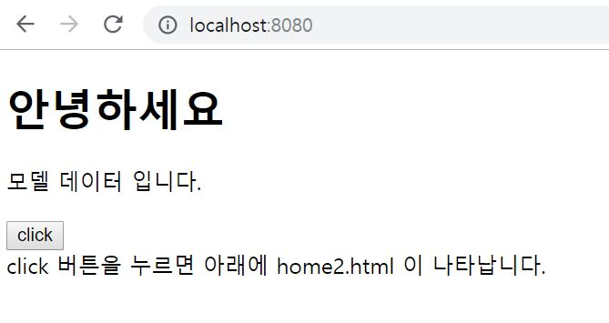
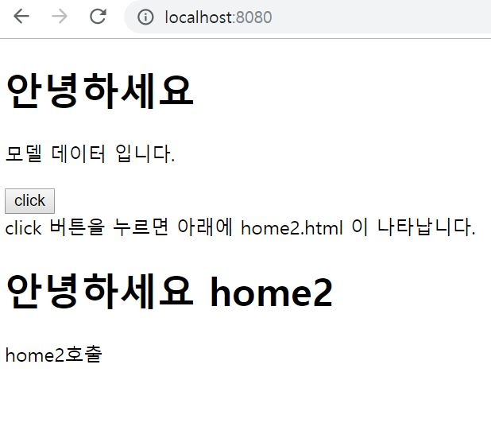

1. 사용자가 Browser를 통해 주소를 입력한다.
2. Controller가 View를 Browser에 나타나게 한다.
3. **사용자가 View에서 액션(클릭, 입력창 엔터 등등)을 하면 그 요청이 Controller에 전달되고 Model로 다시 전달된다.**
4. **Model에서 요청을 처리하고 View에게 변화(요청에 대한 처리 결과)를 알린다.**
5. **View는 변화를 반영하고 Controller를 통해 Browser에 나타난다.**

지난 포스팅에서 브라우저에서 View를 띄워 보았습니다.

이번 포스팅에서는 사용자의 액션에 대한 요청을 처리하도록 코드를 작성해보겠습니다.

프로세스는 다음과 같습니다.

1. 메인화면(home.html)에서 버튼을 클릭하면 jquery를 이용하여 /home2 요청을 합니다.
2. dispatcherServlet은 /home2 요청을 handlerMapping의 도움을 받아 처리할 Controller를 찾아 /home2 요청을 전달합니다. 
3. Controller는 Model에 속성을 설정하고 ViewResolver에게 뷰의 논리명 "home2" 을 전달합니다.
4. Thymeleaf의 TemplateEngine은 home2.html에 Model을 표현하고 home2.html을 메인화면에 전달합니다.
5. 메인화면에 div(id='home2')에 전달받은 html 소스코드를 렌더링 합니다.

~~~

// home.html

<!DOCTYPE html>
<`html xmlns="http://www.w3.org/1999/xhtml"
      xmlns:th="http://www.thymeleaf.org">
  <head>
    <title>home</title>
  </head>
      <!-- jquery 사용 -->
  <body>
	<h1>안녕하세요</h1>
  
  

  <input type="button" id="btn" value="click">   <!-- 버튼을 추가합니다. -->
  click 버튼을 누르면 아래에 home2.html 이 나타납니다.
  
                                  <!-- 전달받은 html소스코드가 그려질 div -->
  

  
  </body>
</html>

// home2.html

<!DOCTYPE html>
<`html xmlns="http://www.w3.org/1999/xhtml"
      xmlns:th="http://www.thymeleaf.org">
  <head>
    <title>home2</title>
  </head>
  <body>
	<h1>안녕하세요 home2</h1>
  
  </body>
</html>

// HomeController.java

package com.example.springTest.web;

import static org.springframework.web.bind.annotation.RequestMethod.*;
import org.springframework.stereotype.Controller;
import org.springframework.ui.Model;
import org.springframework.web.bind.annotation.RequestMapping;

@Controller
public class HomeController {
	
	// GET /home 요청을 처리한다.
	@RequestMapping(value="/home", method=GET)
	public String home(Model model) {
		
		// model에 model 속성에 String 타입의 데이터 셋팅
		model.addAttribute("model", "모델 데이터 입니다.");
		
		// view의 논리명
		return "home";
	}
	
    // ########## 새로 추가된 코드 ##########
	// GET /home2 요청을 처리한다.
	@RequestMapping(value="/home2", method=GET)
	public String home2(Model model) {
		
		// model에 model 속성에 String 타입의 데이터 셋팅
		model.addAttribute("model", "home2호출");
		
		// view의 논리명
		return "home2";
	}
}

~~~

  
[그림1. 메인화면]  
  
[그림2. click 결과]
